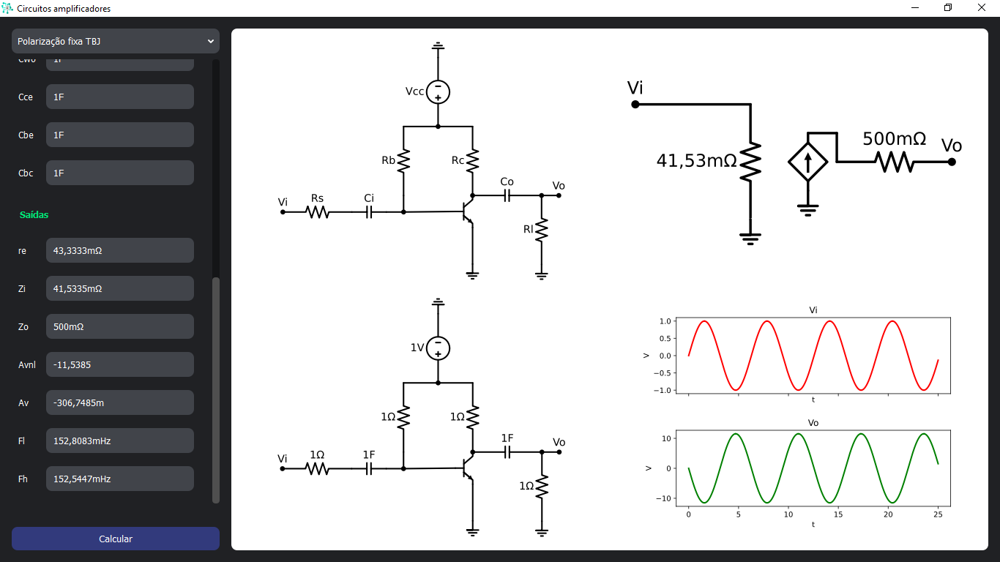

# Amplifier circuits



> _Amplifier circuits_ é um software de código aberto que visa a simplificação de circuitos amplificadores através da representação por modelos simples para corrente alternada.

## 📥 Download

Se você estiver usando o Windows, baixe o zip do [GitHub Releases](https://github.com/luanws/amplifier-circuits/releases/latest), extraia e execute o arquivo `Circuitos amplificadores.exe`.

## 💻 Pré-requisitos

Antes de começar, verifique se você atendeu aos seguintes requisitos:

* Você instalou o [Python 3.10](https://www.python.org/);
* Você tem uma máquina `<Windows / Linux / Mac>`.

## 📦 Instalação

Instale as dependências:

```
pip install -r requirements.txt
```

## 📚 Utilização

Execute o seguinte comando:

```
python main.dev.py
```

## 📫 Contribuindo

Pull requests são sempre bem-vindos 😄.

Consulte a documentação do GitHub em [como criar uma solicitação pull](https://help.github.com/en/github/collaborating-with-issues-and-pull-requests/creating-a-pull-request).

## 📝 Licença

Esse projeto está sob licença. Veja o arquivo [LICENÇA](LICENSE) para mais detalhes.

[⬆ Voltar ao topo](#amplifier-circuits)